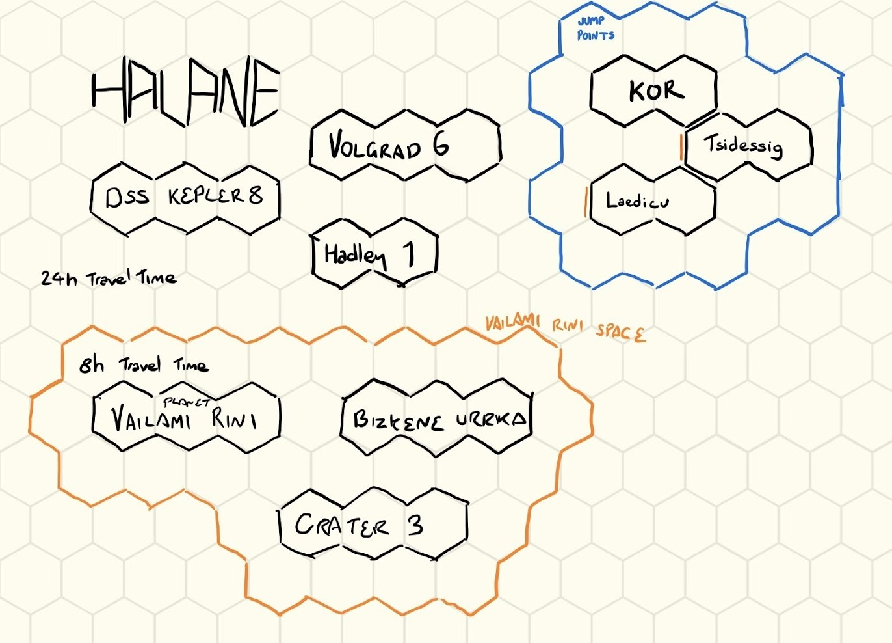

# Halane

[overview](./index.md)

## Scans

### System (24h between bodies)

- VISITED | Hadley 1 Refuelling Station
- VISITED | Volograd 6 Research Base (Radio Silence)
- [Deep Space Station Kepler 8](./dss-kepler-8.md)

### Vailami Rini Space (8h between bodies)

- [Planet Vailami Rini](./vailami-rini.md)
- Bizkene Urrika, Moon
- Crater 3, Orbital Ruin

## Jump Locations

- Kor
- Tsidessig
- Laedicu
